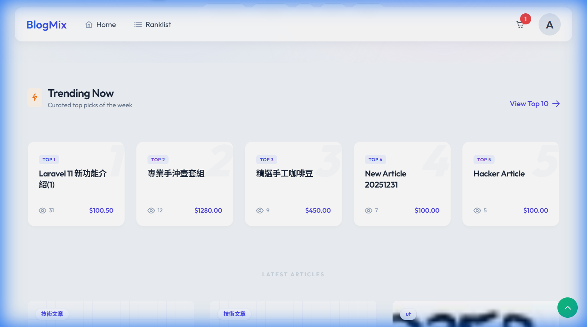
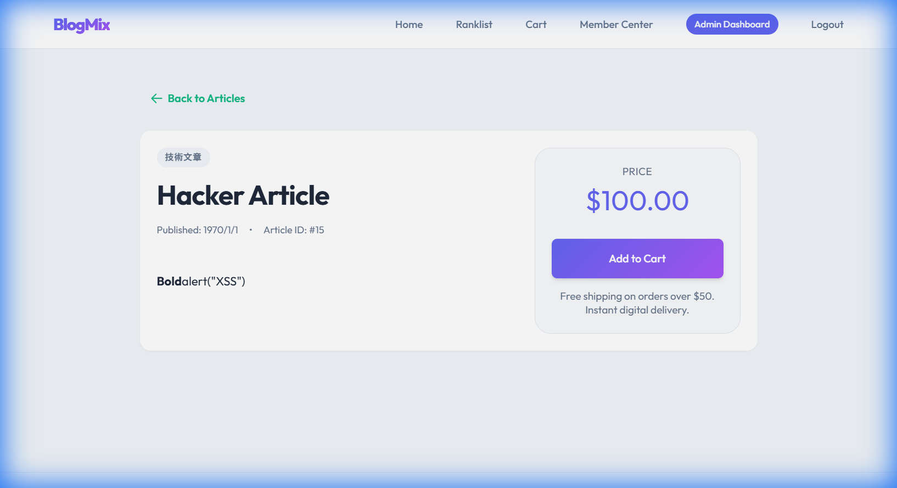
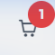
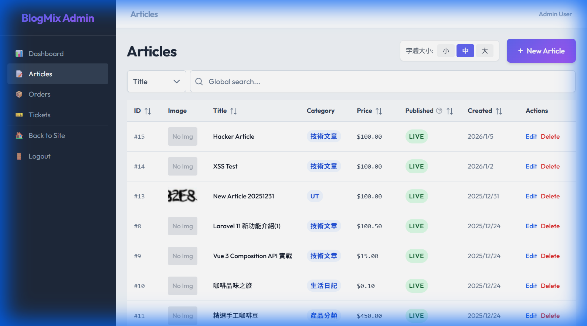
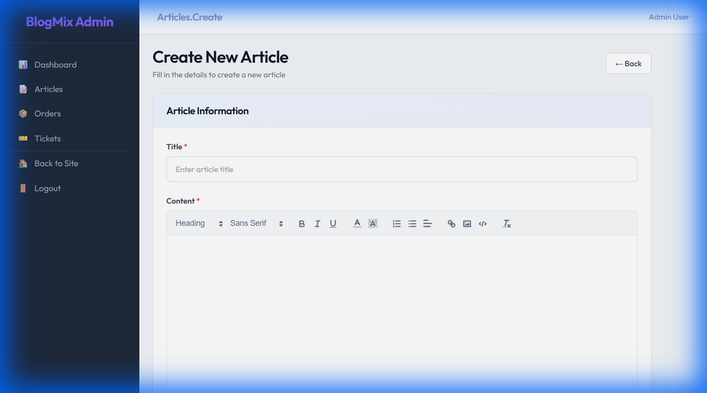
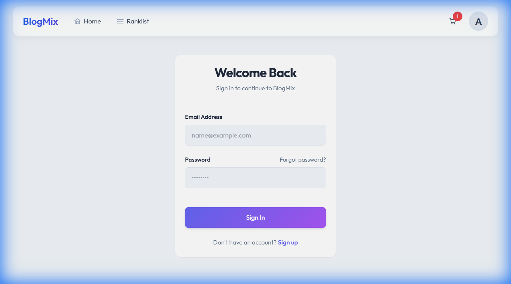
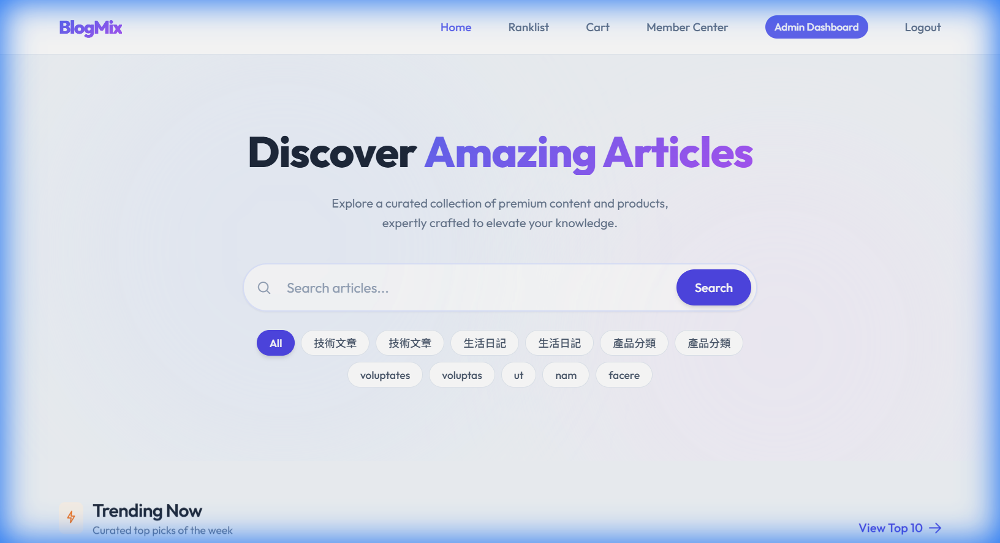

# BlogMix v2 - Modern CMS & E-Commerce Platform



**BlogMix v2** 是一個結合內容管理 (CMS) 與電子商務的現代化 Web 應用程式。我們將傳統的部落格平台重構為高效能、美觀且具備完整購物流程的系統，專注於提供最佳的開發者體驗 (DX) 與使用者體驗 (UX)。

> 🚀 **重生計畫**：本專案是將 2016 年的舊版 PHP 專案，使用 Laravel 11 與 Vue 3 全面現代化重構的成果。

---

## ✨ 核心特色 (Features)

### 🛍️ 內容與商務融合
- **文章即商品**：無縫整合部落格閱讀與購物體驗。
- **購物車系統**：即時互動的側邊欄購物車與完整結帳流程。
- **排行榜 (Ranklist)**：基於瀏覽量與熱門度的動態排序。

### 🎨 現代化 UI/UX設計
- **Glassmorphism**：採用 PrimeVue + Tailwind CSS 打造的玻璃擬態導覽列與卡片。
- **RWD 響應式設計**：完美支援手機、平板與桌面瀏覽。
- **微互動 (Micro-interactions)**：Hover 效果、轉場動畫 (Fade-in)、平滑捲動 (ScrollTop)。

### 🛠️ 強大的後台管理
- **儀表板**：一目了然的營運數據。
- **WYSIWYG 編輯器**：整合圖片上傳與 XSS 防護的文章編輯器。
- **權限控管**：基於 Laravel Sanctum 的安全認證與 Role-based Access Control (RBAC)。

---

## 📸 系統畫面 (Screenshots)

### 📖 舒適的閱讀體驗

*優雅的排版與圖片展示，支援 Rich Text 內容*

### 🛒 沉浸式購物體驗

*懸浮式購物車與動態 Badge 提示*

### ⚙️ 後台管理與文章配置 (Admin & CMS)
<div style="display: flex; gap: 10px;">
  
  
</div>
*左：文章列表管理 (CRUD) | 右：所見即所得編輯器與圖片上傳*

### 👤 會員中心與安全驗證 (Member Services)
<div style="display: flex; gap: 10px;">
  
  
</div>
*左：安全的登入/註冊流程 | 右：會員專屬的各項功能 (手機版)*

### ✨ 細節至上的 UX

*精緻的 Skeleton Loading 骨架屏，優化等待體驗*

---

## 🏗️ 技術堆疊 (Tech Stack)

### Core
- **Framework**: [Laravel 11](https://laravel.com) (PHP 8.2+)
- **Database**: MySQL 8.0 / SQLite (Dev)
- **Cache**: Redis

### Frontend
- **Framework**: [Vue.js 3](https://vuejs.org) (Composition API)
- **UI Toolkit**: [PrimeVue 4](https://primevue.org) + [Tailwind CSS](https://tailwindcss.com)
- **Build Tool**: [Vite](https://vitejs.dev)

### Infrastructure
- **Environment**: Docker (Laravel Sail) with WSL2
- **Offline Dev**: 支援特殊的離線與 SMB 網路磁碟機開發架構 (詳見 `vibe-specs/Project_Handbook.md`)

---

## 🚀 快速開始 (Getting Started)

本專案支援標準 Docker 啟動流程：

1. **Clone 專案**
   ```bash
   git clone https://github.com/your-repo/blogmix-v2.git
   cd blogmix-v2
   ```

2. **啟動環境 (使用 Sail)**
   ```bash
   ./vendor/bin/sail up -d
   ```

3. **安裝依賴**
   ```bash
   sail composer install
   sail npm install && sail npm run dev
   ```

4. **資料庫遷移**
   ```bash
   sail artisan migrate --seed
   ```

5. **訪問**
   - 前台：http://localhost:8081 (或您的 Server IP)
   - 後台：http://localhost:8081/admin (預設帳號: `admin@example.com` / `password`)
   - 郵件測試：http://localhost:8025

---

### 🧪 測試帳號 (Test Accounts)

| 角色 (Role) | 帳號 (Email) | 密碼 (Password) | 權限說明 |
| :--- | :--- | :--- | :--- |
| **Admin** | `admin@example.com` | `password` | 完整後台權限 (Dashboard, Articles, etc.) |
| **Member** | `test@example.com` | `password` | 一般會員 (預設測試帳號) |
| **Member** | *(請自行註冊)* | - | 一般會員權限 (Cart, My Orders) |

---

## 🛠️ 開發指引 (Development Guide)

更多詳細開發文件請參閱 `vibe-specs/` 目錄：
- [📖 專案手冊 (Handbook)](vibe-specs/Project_Handbook.md) - 環境建置與常見問題
- [🏗️ 技術設計 (Architecture)](vibe-specs/technical_design.md) - 資料庫與 API 架構
- [📝 需求規格 (Specification)](vibe-specs/project_specification.md) - 功能清單與流程

---

## 📄 License

The Laravel framework is open-sourced software licensed under the [MIT license](https://opensource.org/licenses/MIT).
